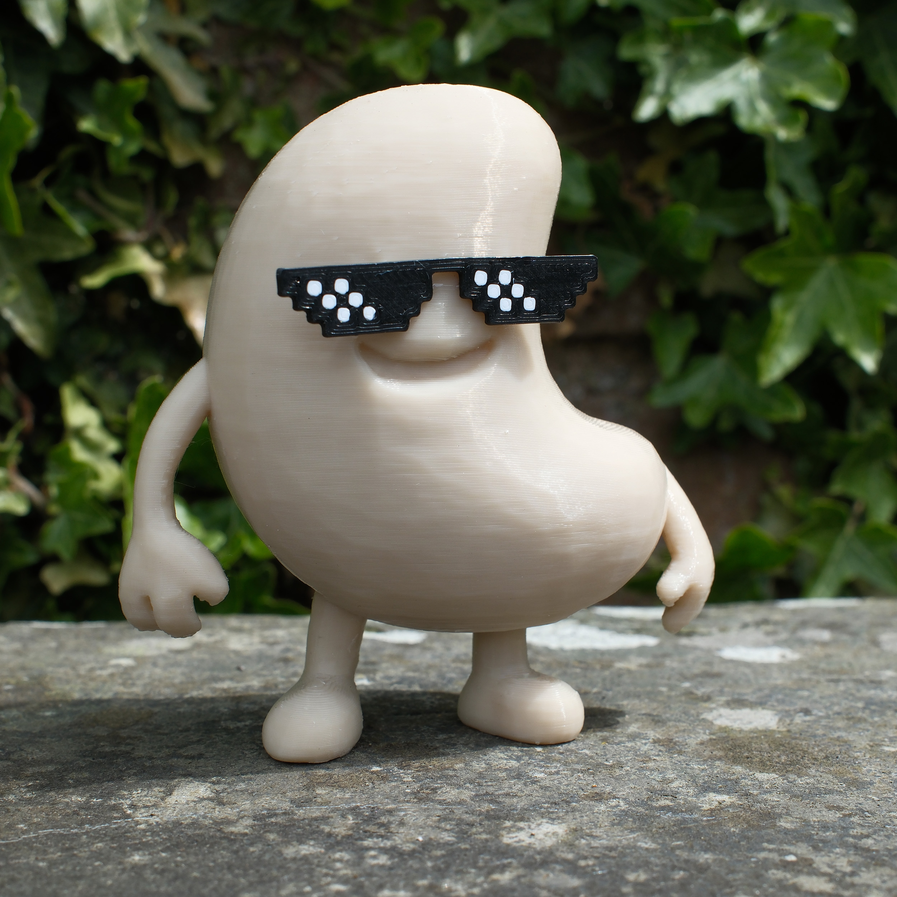

# 🥜 Cashu Figure – 3D Printable Model

This repository contains STL files for printing your own **Cashu Figure**

---

## 🧩 Included Files

- **`Cashu.stl`**  
  The main figure. Print in a nut or light brown colour (e.g. almond, walnut, or peanut tone).

- **`Glasses.stl` and `Glasses white parts.stl`**  
  The sunglasses. Print as a two colour print with black and white filament.

---

## 🛠️ Assembly Instructions

1. **Print all three STL files:**
   - `Cashu.stl` (nut colour)
   - `Glasses`: `Glasses.stl` and `Glasses white parts.stl` (black and white)

2. **Post-process** as required (e.g. remove supports, clean up, light sanding).

3. **Attach** the assembled glasses to the Cashu figure using a small amount of super glue / Kragle.

---

## 🧷 Print Settings

- **Supports:** Required for all parts. DYOR.
- **Height:** Scale as desired.
- **Layer Height:** 0.2mm recommended
- **Infill:** 10–20%
- **Material Suggestions:**
  - PLA
  - Choose colours according to parts (nut brown, black, white)

---

Happy printing!
